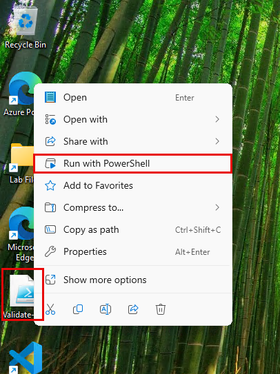
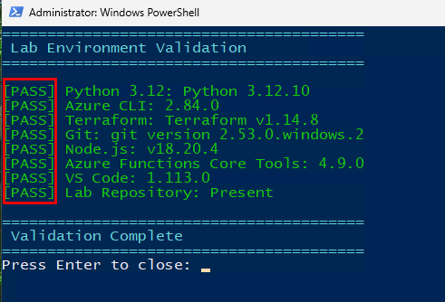
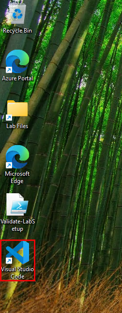
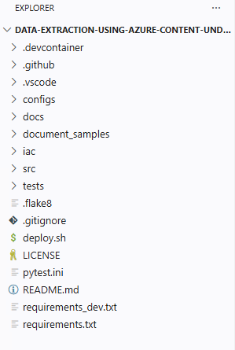
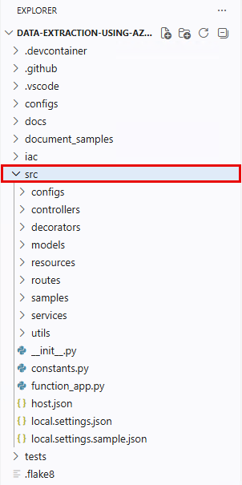
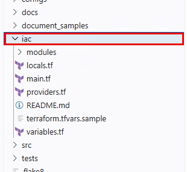

# Data Extraction Using Azure Content Understanding - Lab 01


# Contents

- Introduction

- Scenario / Problem Statement

- Lab Environment Overview

    - Task 1: Verify lab environment prerequisites

    - Task 2: Explore the project structure

    - Task 3: Review the solution architecture

    - Task 4: Understand Azure Content Understanding concepts

- Summary

- References

# Introduction

In this lab, you will be introduced to an intelligent document processing solution built on Azure Content Understanding. This solution demonstrates how to extract structured data from unstructured documents — such as lease agreements — and enable natural language querying over the extracted data using Azure OpenAI.

By the end of this lab, you will have learned:

- How to verify and set up the lab environment prerequisites

- How to clone and explore the project repository structure

- How to read the solution architecture and understand the three core workflows

- How to understand the key concepts behind Azure Content Understanding

# Scenario / Problem Statement

Contoso Ltd. is a large enterprise that manages thousands of lease agreements across its global operations. Currently, extracting key data points (such as monthly rent, lease duration, termination conditions, and compliance terms) from these PDF documents requires manual review by legal and operations teams. This process is slow, error-prone, and does not scale.

To solve this, Contoso is building an intelligent document processing pipeline using **Azure Content Understanding** to automatically extract structured fields from lease agreements, store the results in **Azure Cosmos DB**, and enable employees to query the data conversationally using **Azure OpenAI** with inline citations that trace back to the original documents.

Throughout these labs, you will build and deploy this complete solution from scratch — starting with infrastructure, configuration, document ingestion, and querying — on a serverless Azure Functions architecture.

# Lab Environment Overview

Before we dive into building the solution, let's ensure your lab environment has all the required tools and then explore the repository that contains the complete solution code.

**Note:** Your lab VM has been pre-configured with the necessary software. In this section, you will verify everything is in place.

## Task 1: Verify lab environment prerequisites

In this task, you will run a validation script to confirm that all required tools are installed and accessible on your lab virtual machine.

1. On your lab VM desktop, locate and right-click the **Validate-LabSetup.ps1** file. Select **Run with PowerShell**.

    

2. The script will automatically check all required tools and display the results. Verify that every item shows **[PASS]** status:

    | Tool | Required Version |
    |---|---|
    | Python | 3.12 or later |
    | Azure CLI | 2.60 or later |
    | Terraform | 1.5.0 or later |
    | Azure Functions Core Tools | v4.x |
    | Git | Any |
    | Node.js | 18.x or later |
    | VS Code | Any |
    | Lab Repository | Present at `C:\LabFiles` |

    

>**Note:** If any item shows **[FAIL]**, contact your lab administrator. All tools should be pre-installed on your lab VM.

## Task 2: Explore the project structure

In this task, you will open the pre-cloned repository and understand how the codebase is organized.

1. On the desktop, double-click the **Visual Studio Code** shortcut. It will open directly into the lab repository at `C:\LabFiles\data-extraction-using-azure-content-understanding`.

    

2. In the VS Code **Explorer** panel, review the top-level folder structure. The project is organized as follows:

    | Folder/File | Purpose |
    |---|---|
    | `configs/` | Sample extraction configuration JSON files |
    | `docs/` | Architecture documentation and design decisions |
    | `document_samples/` | Sample PDF documents for testing |
    | `iac/` | Terraform infrastructure as code modules |
    | `src/` | Python source code (Azure Functions application) |
    | `tests/` | Unit and integration tests |
    | `deploy.sh` | One-click deployment script for Azure Cloud Shell |
    | `requirements.txt` | Python package dependencies |

    

3. Expand the **src/** folder to examine the application code structure:

    | Subfolder | Purpose |
    |---|---|
    | `configs/` | Application configuration management (YAML loader) |
    | `controllers/` | API endpoint logic (health check, inference, ingestion) |
    | `decorators/` | Custom error handling decorators |
    | `models/` | Pydantic data models for requests, responses, and documents |
    | `routes/` | Azure Functions HTTP trigger route definitions |
    | `samples/` | Sample `.http` request files for testing APIs |
    | `services/` | Business logic (CU client, Cosmos DB, LLM manager, blob storage) |
    | `utils/` | Utility functions (citation cleaner, monitoring, singleton) |

    

4. Expand the **iac/** folder. Notice the modular Terraform structure:

    | Module | Azure Resource |
    |---|---|
    | `modules/ai/` | AI Hub (Azure OpenAI + Content Understanding + AI Foundry) |
    | `modules/cosmos_db/` | Azure Cosmos DB (Mongo API and SQL API) |
    | `modules/function_app/` | Azure Function App (Python, Linux) |
    | `modules/keyvault/` | Azure Key Vault |
    | `modules/loganalytics/` | Azure Log Analytics Workspace |
    | `modules/storage_account/` | Azure Storage Account |
    | `modules/azure_openai/` | Azure OpenAI deployment (gpt-4o) |
    | `modules/appinsights/` | Application Insights |

    

## Task 3: Review the solution architecture

In this task, you will study the architecture diagram and understand the three core workflows that make up the solution.

1. In VS Code, open the file **docs/architecture.md**.

    

2. Scroll to the top and review the **architecture diagram**. The solution implements three main workflows:

    - **Document Enquiry** — Users ask natural language questions about ingested documents. Azure OpenAI (via Semantic Kernel) retrieves collection data from Cosmos DB and formulates a response with inline citations.

    - **Configuration Upload** — Administrators upload JSON extraction configurations that define which fields to extract from documents. The system creates corresponding Azure Content Understanding analyzer schemas.

    - **Document Ingestion** — PDF documents are submitted to the system. Azure Content Understanding extracts structured fields (with bounding boxes and confidence scores), and the results are stored in Cosmos DB.

    

3. Review the **Document Enquiry Workflow** sequence diagram. This flow shows how:

    a. The user submits a natural language query to the Azure Function.

    b. Semantic Kernel extracts the collection ID from the query.

    c. The system retrieves all extracted fields for that collection from Cosmos DB.

    d. Azure OpenAI formulates a response with inline citations referencing the source documents.

    e. The response is returned to the user with citation metadata (source PDF path and bounding box coordinates).

4. Review the **Configuration Upload Workflow** sequence diagram. This flow shows how:

    a. The user uploads a JSON configuration file via the API.

    b. The configuration is validated and stored in Cosmos DB.

    c. For each collection row in the configuration, an Azure Content Understanding analyzer schema is created.

    d. A SHA-256 hash of the extraction configuration is computed for versioning.

5. Review the **Document Ingestion Workflow** sequence diagram. This flow shows how:

    a. A PDF document is uploaded to the system.

    b. The system retrieves the extraction configuration from Cosmos DB.

    c. The document is sent to Azure Content Understanding for field extraction.

    d. Extracted fields (with bounding boxes, confidence scores, and markdown) are stored in Cosmos DB.

    e. The document markdown is uploaded to Azure Blob Storage for reference.

## Task 4: Understand Azure Content Understanding concepts

In this task, you will learn the key concepts of Azure Content Understanding that power the document extraction pipeline.

1. In VS Code, open the file **docs/design/decisions/content-undestanding-vs-mllm-docint.md**. This architecture decision record (ADR) explains why Azure Content Understanding was chosen over alternatives.

    

2. Review the key advantages of Azure Content Understanding:

    - **Multimodal ingestion** — Supports documents, images, video, and audio content.

    - **Strongly-typed schemas** — Define exact field names, types, and descriptions for extraction.

    - **Confidence scores** — Each extracted field includes a confidence score indicating extraction reliability.

    - **Bounding boxes** — Precise document coordinates for every extracted field, enabling traceability to the source.

    - **Analyzer schemas** — Reusable, versioned configurations that define what to extract.

    - **Classifier support** — Intelligent document classification to route different document types to different analyzers.

3. Open the file **configs/document-extraction-v1.0.json** to see a sample extraction configuration:

    ```json
    {
        "id": "document-extraction-v1.0",
        "name": "document-extraction",
        "version": "v1.0",
        "collection_rows": [
            {
                "data_type": "LeaseAgreement",
                "field_schema": [
                    {
                        "name": "license_grant_scope",
                        "type": "string",
                        "description": "Scope of the license grant",
                        "method": "extract"
                    },
                    {
                        "name": "lease_duration",
                        "type": "string",
                        "description": "Duration of the lease agreement",
                        "method": "extract"
                    }
                ],
                "analyzer_id": "test-analyzer"
            }
        ]
    }
    ```

    

4. Notice the structure:

    - **id** and **version** — Uniquely identify this extraction configuration.

    - **collection_rows** — An array defining document types. Each row specifies a `data_type`, a `field_schema` (list of fields to extract), and an `analyzer_id` that maps to an Azure Content Understanding analyzer.

    - **field_schema** — Each field has a `name`, `type` (string, integer, float, boolean, date, etc.), a human-readable `description`, and a `method` (either `extract` for CU extraction or `generate` for LLM generation).

5. Open the file **document_samples/** folder. Notice the sample PDF — **Agreement_for_leasing_or_renting_certain_Microsoft_Software_Products.pdf**. This is the lease agreement document that you will ingest and query in later labs.

    

>**Note:** In a production scenario, you would have hundreds or thousands of such documents being ingested automatically via blob storage triggers.

# Summary

In this lab, you verified that your lab environment has all the necessary prerequisites, cloned the solution repository, explored the project structure, studied the three-workflow architecture, and understood the key concepts behind Azure Content Understanding.

In the next lab, you will deploy all the required Azure infrastructure using Terraform.

# References

Data Extraction Using Azure Content Understanding introduces you to building an intelligent document processing solution on Azure. Here are resources to help you continue learning:

- Read the [Azure Content Understanding documentation](https://learn.microsoft.com/en-us/azure/ai-services/content-understanding/)

- Explore the [Azure OpenAI Service documentation](https://docs.microsoft.com/azure/cognitive-services/openai/)

- Review the [Azure Functions Python Developer Guide](https://docs.microsoft.com/azure/azure-functions/functions-reference-python)

- Learn about [Azure Cosmos DB](https://docs.microsoft.com/azure/cosmos-db/)

- Explore the [Terraform AzureRM Provider documentation](https://registry.terraform.io/providers/hashicorp/azurerm/latest/docs)

- Read about [Semantic Kernel](https://learn.microsoft.com/en-us/semantic-kernel/overview/)

- Understand [Azure Key Vault secrets management](https://learn.microsoft.com/en-us/azure/key-vault/secrets/about-secrets)

- Learn about [Azure Blob Storage](https://learn.microsoft.com/en-us/azure/storage/blobs/storage-blobs-introduction)

- Review [Azure Application Insights](https://learn.microsoft.com/en-us/azure/azure-monitor/app/app-insights-overview)

- Explore [Azure AI Foundry](https://learn.microsoft.com/en-us/azure/ai-studio/what-is-ai-studio)

© 2026 Microsoft Corporation. All rights reserved.

By using this demo/lab, you agree to the following terms:

The technology/functionality described in this demo/lab is provided by Microsoft Corporation for purposes of obtaining your feedback and to provide you with a learning experience. You may only use the demo/lab to evaluate such technology features and functionality and provide feedback to Microsoft. You may not use it for any other purpose. You may not modify, copy, distribute, transmit, display, perform, reproduce, publish, license, create derivative works from, transfer, or sell this demo/lab or any portion thereof.

COPYING OR REPRODUCTION OF THE DEMO/LAB (OR ANY PORTION OF IT) TO ANY OTHER SERVER OR LOCATION FOR FURTHER REPRODUCTION OR REDISTRIBUTION IS EXPRESSLY PROHIBITED.

THIS DEMO/LAB PROVIDES CERTAIN SOFTWARE TECHNOLOGY/PRODUCT FEATURES AND FUNCTIONALITY, INCLUDING POTENTIAL NEW FEATURES AND CONCEPTS, IN A SIMULATED ENVIRONMENT WITHOUT COMPLEX SET-UP OR INSTALLATION FOR THE PURPOSE DESCRIBED ABOVE. THE TECHNOLOGY/CONCEPTS REPRESENTED IN THIS DEMO/LAB MAY NOT REPRESENT FULL FEATURE FUNCTIONALITY AND MAY NOT WORK THE WAY A FINAL VERSION MAY WORK. WE ALSO MAY NOT RELEASE A FINAL VERSION OF SUCH FEATURES OR CONCEPTS. YOUR EXPERIENCE WITH USING SUCH FEATURES AND FUNCTIONALITY IN A PHYSICAL ENVIRONMENT MAY ALSO BE DIFFERENT.

**FEEDBACK**. If you give feedback about the technology features, functionality and/or concepts described in this demo/lab to Microsoft, you give to Microsoft, without charge, the right to use, share and commercialize your feedback in any way and for any purpose. You also give to third parties, without charge, any patent rights needed for their products, technologies and services to use or interface with any specific parts of a Microsoft software or service that includes the feedback. You will not give feedback that is subject to a license that requires Microsoft to license its software or documentation to third parties because we include your feedback in them. These rights survive this agreement.

MICROSOFT CORPORATION HEREBY DISCLAIMS ALL WARRANTIES AND CONDITIONS WITH REGARD TO THE DEMO/LAB, INCLUDING ALL WARRANTIES AND CONDITIONS OF MERCHANTABILITY, WHETHER EXPRESS, IMPLIED OR STATUTORY, FITNESS FOR A PARTICULAR PURPOSE, TITLE AND NON-INFRINGEMENT. MICROSOFT DOES NOT MAKE ANY ASSURANCES OR REPRESENTATIONS WITH REGARD TO THE ACCURACY OF THE RESULTS, OUTPUT THAT DERIVES FROM USE OF DEMO/ LAB, OR SUITABILITY OF THE INFORMATION CONTAINED IN THE DEMO/LAB FOR ANY PURPOSE.

**DISCLAIMER**

This demo/lab contains only a portion of new features and enhancements in Microsoft Azure. Some of the features might change in future releases of the product. In this demo/lab, you will learn about some of the new features but not all of the new features.
